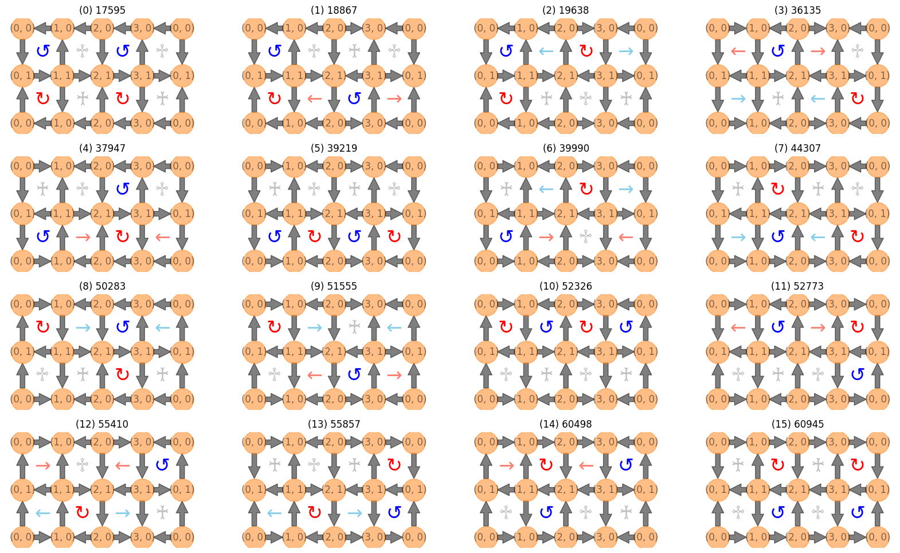

# qlinks: Quantum link model

_________________

[](http://badge.fury.io/py/qlinks)
[](https://pepy.tech/project/qlinks)
[](https://codecov.io/gh/tanlin2013/qlinks)
[](https://gitter.im/tanlin2013/qlinks?utm_source=badge&utm_medium=badge&utm_campaign=pr-badge&utm_content=badge)
[](https://github.com/psf/black)
[](https://timothycrosley.github.io/isort/)
[](https://pypi.python.org/pypi/qlinks/)
[](https://github.com/tanlin2013/qlinks/actions/workflows/build.yml)
[](https://github.com/tanlin2013/qlinks/actions/workflows/test.yml)
[](https://github.com/tanlin2013/qlinks/actions/workflows/lint.yml)
_________________

[Documentation](https://tanlin2013.github.io/qlinks/) |
_________________

Quantum link model

Installation
------------
#### 1. Install the package from PyPI:
```bash
pip install qlinks
```
#### 2. Install the package from source:
```bash
poetry install --all-extras
```
#### 3. Docker
```bash
docker pull tanlin2013/qlinks:latest
```

Getting started
---------------

#### 1. Enumeration of the Basis


We implement the depth-first search (backtracking) algorithm
to enumerate all basis satisfying the Gauss law.

```python
from qlinks.solver.deep_first_search import DeepFirstSearch
from qlinks.symmetry.gauss_law import GaussLaw

lattice_shape = (4, 2)
gauss_law = GaussLaw.from_staggered_charge_distri(*lattice_shape)
gauss_law.flux_sector = (0, 0)
dfs = DeepFirstSearch(gauss_law, max_steps=int(1e8))
basis = gauss_law.to_basis(dfs.solve(n_solution=16))
```

#### 2. Easy construction of the Hamiltonian

```python
from qlinks.model import QuantumLinkModel

coup_j, coup_rk = (1.0, 1.0)
model = QuantumLinkModel(coup_j, coup_rk, lattice_shape, basis)
ham = model.hamiltonian.todense()
```
The Hamiltonian is a scipy sparse matrix, but we can convert it to a dense matrix for small systems.

License
-------
© Tan Tao-Lin, 2023. Licensed under
a [MIT](https://github.com/tanlin2013/qlinks/master/LICENSE)
license.
