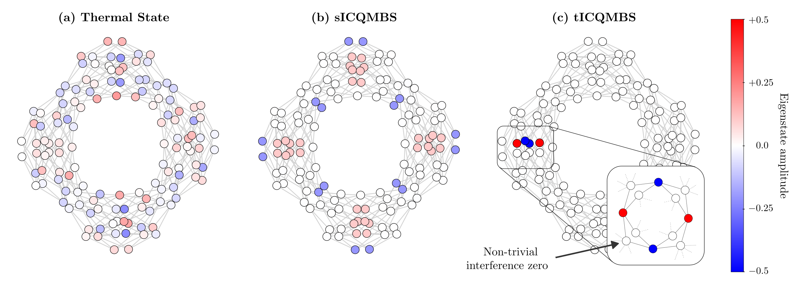
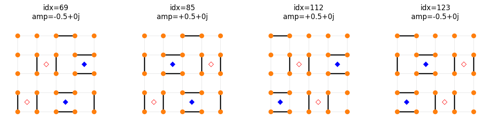
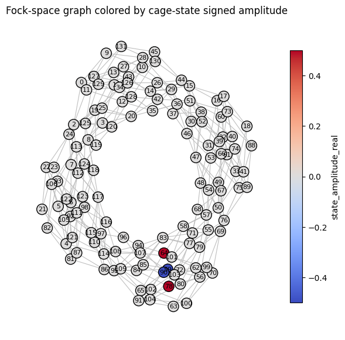

# qlinks

[](http://badge.fury.io/py/qlinks)
[](https://pepy.tech/project/qlinks)
[](https://codecov.io/gh/tanlin2013/qlinks)
[](https://github.com/psf/black)
[](https://pycqa.github.io/isort/)
[](https://github.com/tanlin2013/qlinks/blob/main/LICENSE)
[](https://github.com/tanlin2013/qlinks/actions/workflows/build.yml)
[](https://github.com/tanlin2013/qlinks/actions/workflows/test.yml)
[](https://github.com/tanlin2013/qlinks/actions/workflows/lint.yml)

[Documentation](https://tanlin2013.github.io/qlinks/)

`qlinks` is a Python package for building constrained lattice Hamiltonians and studying their Fock-space structure. It is mainly designed for exact diagonalization workflows in quantum link models, quantum dimer models, constrained spin models, and related lattice systems.

The current `main` branch contains the lattice-abstraction refactor formerly developed on the `abstract_lattice` branch.




---

## Features

- Constraint-aware basis construction
- Sparse Hamiltonian construction with `scipy.sparse`
- Geometry-aware lattice support for square, triangular, and honeycomb lattices
- Topological / winding-sector workflows where available
- Fock-space graph visualization
- Interference-cage search utilities
- HDF5-oriented workflows for large sweeps

---

## Installation

Install from PyPI:

```bash
pip install qlinks
```

Install from source:

```bash
poetry install --all-extras
```

Docker image:

```bash
docker pull tanlin2013/qlinks:main
```

---

## Quick start

The typical workflow is:

1. build a lattice model,
2. construct the constrained basis and Hamiltonian,
3. search for interference cages,
4. visualize the cage in real space and in the Hamiltonian graph.

The exact public API is still evolving, so treat this section as the intended high-level workflow.

### 1. Build a model and Hamiltonian

```python
from qlinks.models import SquareQDMModel

model = SquareQDMModel(
    lx=4,
    ly=4,
    boundary_condition="periodic",
    winding_x=0,
    winding_y=0,
    coup_kin=1.0,
    coup_pot=1.0,
)

build_result = model.build(
    basis_solver="dfs",
    builder="sparse",
    backend="scipy",
    sort_basis=True,
    on_missing="raise",
)

H = build_result.hamiltonian
K = build_result.kinetic
V = build_result.potential
basis = build_result.basis
```

`H` is the full Hamiltonian, `K` is the kinetic/off-diagonal term, and `V` is the potential/diagonal term when the model provides one.

### 2. Run a cage search

```python
from qlinks.caging import CageSearchConfig, CageSearcher

config = CageSearchConfig(
    search_type="qdm",
    type1_kappas=(0,),
    tolerance=1e-10,
    degenerate_basis_strategy="ipr",
    ipr_n_restarts=256,
    ipr_candidate_count=128,
    ipr_random_seed=1234,
)

searcher = CageSearcher.from_model_build_result(
    build_result,
    config=config,
)

search_result = searcher.run()
print(search_result.counts_by_signature)
```
> {(0, 4): 12, (0, 6): 9}

A cage result is expected to contain the participating basis-state indices, the restricted eigenvector, and useful metadata such as kinetic/potential quantum numbers when available.

### 3. Plot basis states in a cage

```python
from qlinks.visualizer import BasisGridVisualizer

signature = (0, 4)
record_index = 0

grid_visualizer = BasisGridVisualizer(
    lattice=model.lattice,
    layout=model.layout,
    periodic_image_mode="positive_patch",
)

grid_visualizer.plot_cage_support(
    search_result,
    basis_configs=basis.states,
    signature=signature,
    record_index=record_index,
    ncols=4,
    mode="dimers",
    plaquette_symbols="resonance",
    show_config_label=False,
)
```



### 4. Plot the cage on the Hamiltonian graph

```python
from qlinks.visualizer import HamiltonianGraphVisualizer, HamiltonianGraphStyle

# Lazy indexing by [signature, record_index]
record = search_result[signature, record_index]

graph_visualizer = HamiltonianGraphVisualizer.from_sparse_matrix(
    K,
    include_self_loops=False,
    style=HamiltonianGraphStyle(
        cmap="coolwarm",
        label_vertices=True,
    ),
)

graph_visualizer.plot(
    backend="igraph-mpl",
    color_by="state_amplitude_real",
    state_vector=record.full_state,
    layout="kk",
)
```



---

## Testing

Run the test suite:

```bash
pytest
```

Run manual visual tests:

```bash
QLINKS_SHOW_PLOTS=1 pytest
```

Run pre-commit checks:

```bash
pre-commit run --all-files
```

---

## Notes on models

- Square-lattice QLM with staggered background charges is closely related to the square-lattice QDM.
- Honeycomb QLM usually requires nonzero background charges to obtain a nonempty constrained Hilbert space.
- Winding and topological sector labels are geometry-dependent and should be interpreted with the convention used by each model.

---

## Documentation

The documentation is hosted on GitHub Pages:

<https://tanlin2013.github.io/qlinks/>

(<span style="color:red">Outdated and unmaintained</span>)

---

## References

1. T.-L. Tan and Y.-P. Huang, Interference-caged quantum
many-body scars: the fock space topological localization
and interference zeros, arXiv preprint [arXiv:2504.07780
(2025)](https://arxiv.org/abs/2504.07780).

2. T. Ben-Ami, M. Heyl, and R. Moessner, Many-body
cages: disorder-free glassiness from flat bands in fock
space, and many-body rabi oscillations, arXiv preprint
arXiv:2504.13086 (2025).

3. E. Nicolau, M. Ljubotina, and M. Serbyn, Fragmentation, zero modes, and collective bound states in
constrained models, arXiv preprint arXiv:2504.17627
(2025).

4. C. Jonay and F. Pollmann, Localized fock space
cages in kinetically constrained models, arXiv preprint
arXiv:2504.20987 (2025).

---

## License

© Tan Tao-Lin, 2023. Licensed under the [MIT License](https://github.com/tanlin2013/qlinks/blob/main/LICENSE).
